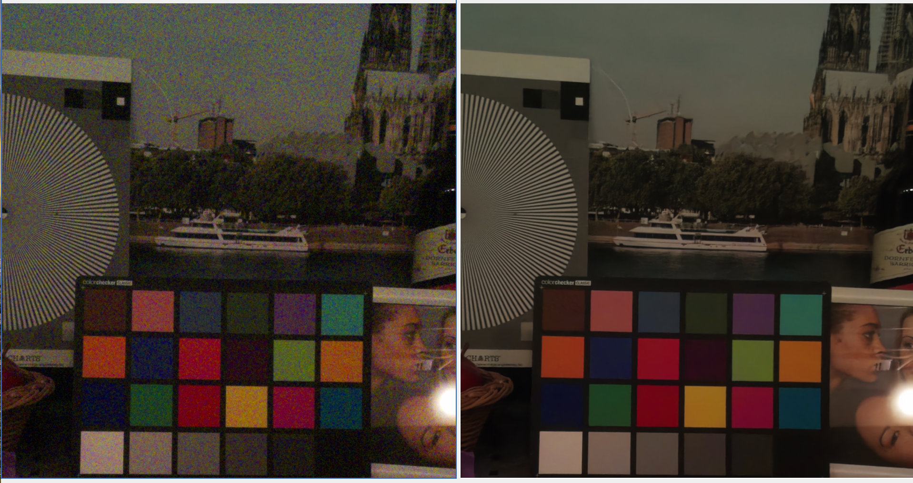

# AI Raw/RGB Image Denoising Tools

## Introduction

This repository contains Python code that implements two command-line tools for image denoising:

1.  **RGB Image Denoising (`rgb.py`)**: Denoises standard RGB images (e.g. PNG files).
2.  **Raw Image Denoising and Processing (`dng.py`)**: Processes digital negative (DNG) raw image files captured on a Raspberry Pi using either `rpicam-still` or Picamera2. The tool provides options for denoising, defective pixel correction, lens shading correction, and more before converting to RGB or saving as a new DNG.

Both tools use TFLite neural network models (via the `ai_edge_litert` library) to perform the denoising. There are two versions ("large" and "small") of both the RGB and the Bayer models.

## Denoising Example

Here's an example of the capabilities of these tools. The original noisy image is on the left, and the denoised version on the right:



## Installation

1.  **Clone the repository:**
    ```bash
    git clone https://github.com/raspberrypi/AI_denoise
    ```

2.  **Install dependencies:**

    These instructions are for use on Raspberry Pi OS. Note that the tools will in principle run
    on any platform, but there may be differences in the installation procedure. There are therefore no
    dependencies on Raspberry Pi camera software, such as libcamera or Picamera2.

    We assume that Python 3 is already installed, along with numpy.

    First execute:
    ```bash
    sudo apt install -y python3-opencv python3-rawpy libexiv2-dev libboost-python-dev
    ```
    Next, install the following Python packages using pip:
    ```bash
    pip install py3exiv2 tqdm ai-edge-litert
    ```

    On non-Pi devices there probably won't be a `python3-rawpy` apt package, so you will have to omit that
    and add `rawpy` to the pip install list instead.

## Quick Start Tutorial

Once you've completed the installation, let's quickly try the tools out to see what they do.

First of all, check you're in the directory where you cloned the `AI_denoise` repository, and then capture
a noisy RGB image and a noisy DNG file as follows.
```bash
rpicam-still -r -e png -o noisy.png --denoise off --sharpness 0 --gain 12
```
Obsserve that:
* We're capturing both a DNG and a PNG file. The PNG codec is recommended over JPG for use with the RGB denoise models.
* Denoise and sharpening are both turned off, as this is recommended for the RGB denoise models too.
* The gain has been set high so that we have some noise to get rid of!

To denoise the RGB image we can use:
```bash
AI_denoise/rgb.py --input noisy.png --output denoised_small.jpg
```
Be sure to compare the two images!

We included `small` in the output file name because by default it uses the "small" RGB denoising
model. To denoise using the "large" model, we do the same thing again, changing the output filename and
specifying the network we want to use.
```bash
AI_denoise/rgb.py --input noisy.png --output denoised_large.jpg --network AI_denoise/networks/nafnet_rgb_large.tflite
```
Next, we're going to denoise the DNG file. We're going apply _both_ denoise _and_ lens shading correction as calibrated in the camera tuning file, and write out a new DNG. Then we're also going to convert this into
a finished RGB image for us to inspect. Both the output files - the new DNG and the RGB output - are optional.
```bash
AI_denoise/dng.py --input noisy.dng --denoise on --output-dng denoised_small.dng --output-rgb denoised_small.jpg
```
Again, note that:
* We have turned denoise on, but LSC (lens shaing correction) is enabled by default.
* Both output files have been named as "small", because by default the smaller of the Bayer denoise models is chosen.

We can switch to the "large" model instead by adding the extra parameter
```bash
--network AI_denoise/networks/nafnet_bayer_large.tflite
```
to the command line, just as we did in the RGB case.

Finally, spend a few moments comparing the denoised JPG files to each other and to the original noisy image. Also don't forget to look at the new DNG files (comparing them to the original again) with your favourite raw converter!

## More on RGB Image Denoising (`rgb.py`)

The `rgb.py` script takes an RGB image (e.g. PNG, JPG) as input, applies a denoising neural network, and saves the output.

**Usage:**

```bash
python3 rgb.py --input <input_image_file> --output <output_image_file> [options]
```

**Key Options:**

*   `--input`: (Required) Path to the input RGB image file.
*   `--output`: (Required) Path to save the denoised RGB image.
*   `--network`: Path to the TFLite model for RGB denoising. Defaults to `networks/nafnet_rgb_small.tflite`.
*   `--overlap <pixels>`: Number of overlap pixels for patch-based processing (default: `16`).
*   `-y`, `--yes`: Overwrite the output file if it already exists.

Please enter `python3 rgb.py --help` for further information.

We recommend using the PNG image format for the input images. Being lossless, PNG preserves the noise structure that the neural network model was trained on. For the same reason, images should also be captured with no denoise or sharpening
applied to them by the Raspberry Pi's imaging pipeline.

**Example:**

```bash
python3 rgb.py --input noisy_photo.png --output denoised_photo.jpg
```

## More on Raw Image Processing & Denoising (`dng.py`)

The `dng.py` script processes DNG raw files. It can apply various corrections and enhancements to the raw sensor data before either saving it as a new DNG file or converting it to a standard RGB image format.

**Usage:**

```bash
python3 dng.py --input <input_dng_file> [options]
```

**Key Options:**

*   `--input`: (Required) Path to the input DNG file.
*   `--output-dng`: Path to save the processed raw data as a new DNG file.
*   `--output-rgb`: Path to save the processed and converted image as an RGB file (e.g. JPG, PNG).
*   `--network`: Path to the TFLite model for raw (Bayer) denoising. Defaults to `networks/nafnet_bayer_small.tflite`.
*   `--denoise <on|off>`: Enable or disable neural network denoising (default: `off`).
*   `--dpc <on|off>`: Enable or disable Defective Pixel Correction (default: `off`).
*   `--lsc <on|off>`: Enable or disable Lens Shading Correction (default: `on`).
*   `--digital-gain <value>`: Apply extra digital gain (default: `1.0`).
*   `--gamma <r_gamma,b_gamma>`: Comma-separated gamma values (e.g. "2.2,4.5") which are interpreted in the same way that [`rawpy.postprocess`](https://letmaik.github.io/rawpy/api/rawpy.Params.html) does. Defaults to tuning file gamma.
*   `--colour-gains <r_gain,b_gain>`: Comma-separated red and blue channel gains (e.g. "1.7,2.3"). Defaults to gains from DNG metadata.
*   `--tuning <tuning_file.json>`: Path to a custom camera tuning file.
*   `--sensor <sensor_name>`: Specify sensor model (e.g. `imx477`), sometimes needed if not in DNG metadata.
*   `--overlap <pixels>`: Number of overlap pixels for patch-based processing (default: `16`).
*   `-y`, `--yes`: Overwrite output file(s) if they already exist.

Please enter `python3 dng.py --help` for further information.

Note that the `--sensor` (or just `-s`) option may be needed with DNG files from Picamera2. Picamera2 has historically not included
the sensor name in the DNG metadata, so it must supplied externally (for example, `-s imx477`). Going forward,
this problem will be fixed.

To use a more specialised camera tuning file, such as `imx477_scientific.json`, you can specify it with the `--tuning` parameter.

**Examples:**

1.  **Denoise a DNG and save as RGB:**
    ```bash
    python3 dng.py --input image.dng --denoise on --output-rgb denoised_image.jpg
    ```

2.  **Apply DPC, LSC, denoise with a specific model, and save as a new DNG:**
    ```bash
    python3 dng.py --input image.dng --dpc on --lsc on --denoise on --network networks/nafnet_bayer_large.tflite --output-dng processed_image.dng
    ```
    We note that DPC is normally only required with the imx219 sensor (v2 camera) as the other sensors generally include it as a built-in feature.

3.  **Convert DNG to JPG with custom gamma and color gains:**
    ```bash
    python3 dng.py --input image.dng --output-rgb custom_render.jpg --gamma "2.2,4.5" --colour-gains "1.8,2.1"
    ```

## Networks and Performance

There are currently 4 networks provided, two RGB denoise models and two Bayer denoise models. The Bayer models have come out larger than the RGB ones, nonetheless they perform well in terms of execution time because they have only 1/3 the pixel values to process. Also, the small models execute more quickly than the large ones, though not dramaticaly so - execution time is relatively loosely coupled to model size.

| Model          | Type         | Parameters | Performance (s/MP) | Quality         |
|----------------|--------------|------------|--------------------|-----------------|
| **RGB Large**  | RGB images   | 1.1M       | 7.9                | Very very high  |
| **RGB Small**  | RGB images   | 0.5M       | 4.9                | Very high       |
| **Bayer Large**| Bayer images | 17.7M      | 4.6                | Very very high  |
| **Bayer Small**| Bayer images | 1.1M       | 2.3                | Very high       |

Performance numbers are approximate and measured in seconds per megapixel on a Pi 5.

Some other general points to note:

* The models are trained on Raspberry Pi camera images taken at full resolution. In all other cases, results may vary.
* After denoising, the models tend to be a little soft and will benefit from some sympathetic sharpening.
* All models are based on [NAFNet](https://arxiv.org/pdf/2204.04676v4).

## License

This project is licensed under the BSD 2-Clause License. See the [LICENSE](LICENSE) file for details.